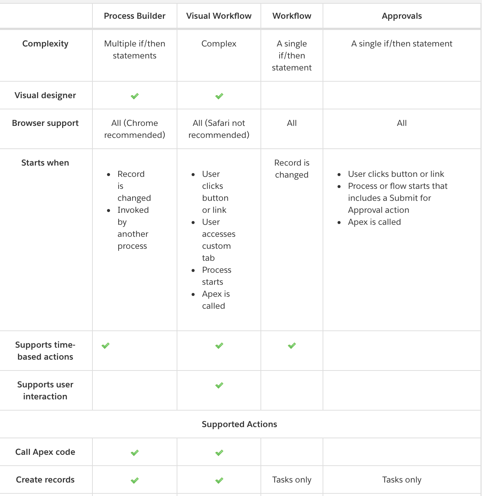
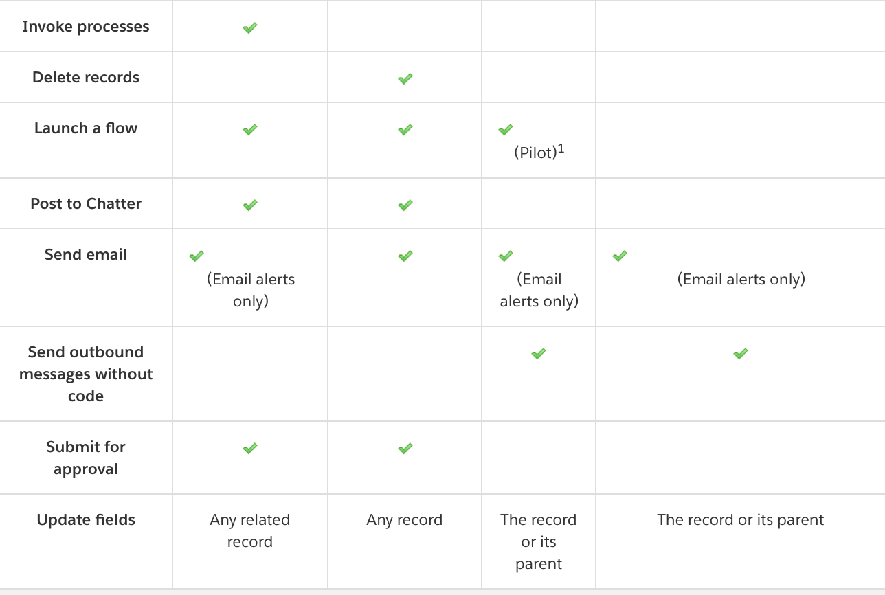

## SFDC Process Builder notes

#### I. How to use Process Builder to provide Opportunity Assignment Rules feature (like Lead and Case Assignment rules)?


Screenshot showing sample Lead Assignment Rule:

``` python
if  Lead.Industry == 'Entertainment' :
	assign_to('this_user')
```


#### Use case

- Assign the owner for the Opportunity record being created based on this Criteria:

1. Opportunity.Amount            >= $30,000
2. AND Opportunity.Probability   >=  50% 
3. OR Opportunity.Stage == 'Value Proposition'
	
So the logic needed is : **1 AND (2 OR 3)**


**Demo showing the Opportunity Assignment :**


- **Post to Chatter page of the user** (to whom this newly created Opportunity is assigned to) about this assignmet:

Example:

```
Opportunity: 800 solar panels with amount: 34,000 in stage:Value Proposition is just routed to you!

```
<hr/>

**Demo showing the chatter post:**


### Automation tools comparsion 




[Ref](https://trailhead.salesforce.com/modules/business_process_automation/units/process_whichtool)
