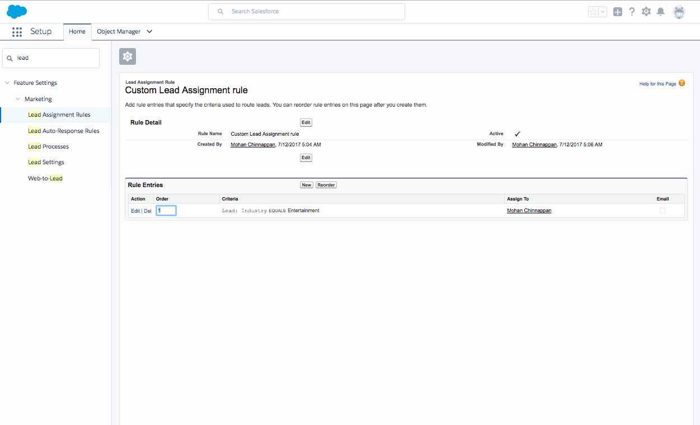
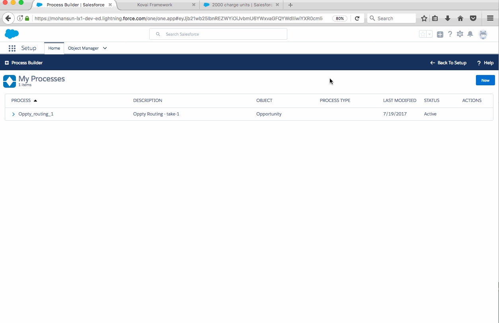

## SFDC Process Builder notes

#### I. How to use Process Builder to provide Opportunity Assignment Rules feature (like Lead and Case Assignment rules)?


Screenshot showing sample Lead Assignment Rule:

``` python
if  Lead.Industry == 'Entertainment' :
	assign_to('this_user')
```




#### Use case

- Assign the owner for the Opportunity record being created based on this Criteria:

1. Opportunity.Amount            >= $30,000
2. AND Opportunity.Probability   >=  50% 
3. OR Opportunity.Stage == 'Value Proposition'
	
So the logic needed is : **1 AND (2 OR 3)**


**Demo showing the Opportunity Assignment :**


- **Post to Chatter page of the user** (to whom this newly created Opportunity is assigned to) about this assignmet:

Example:

```
Opportunity: 800 solar panels with amount: 34,000 in stage:Value Proposition is just routed to you!

```
<hr/>

**Demo showing the chatter post:**




<table class="featureTable sort_table" summary="">
          
          
          
          
          
          <thead class="thead sorted" align="left">
            <tr>
              <th class="featureTableHeader  text-center" id="d441125e257"></th>

              <th class="featureTableHeader  text-center" id="d441125e259">Process Builder</th>

              <th class="featureTableHeader  text-center" id="d441125e262">Visual Workflow</th>

              <th class="featureTableHeader  text-center" id="d441125e265">Workflow</th>

              <th class="featureTableHeader  text-center" id="d441125e268">Approvals</th>

            </tr>

          </thead>

          <tbody class="tbody">
            <tr>
              <td class=" text-center" headers="d441125e257" data-title=""><strong class="ph b">Complexity</strong></td>

              <td class=" text-center" headers="d441125e259" data-title="Process Builder">Multiple if/then statements</td>

              <td class=" text-center" headers="d441125e262" data-title="Visual Workflow">Complex</td>

              <td class=" text-center" headers="d441125e265" data-title="Workflow">A single if/then statement</td>

              <td class=" text-center" headers="d441125e268" data-title="Approvals">A single if/then statement</td>

            </tr>

            <tr>
              <td class=" text-center" headers="d441125e257" data-title=""><strong class="ph b">Visual designer</strong></td>

              <td class=" text-center" headers="d441125e259" data-title="Process Builder"></td>

              <td class=" text-center" headers="d441125e262" data-title="Visual Workflow"></td>

              <td class=" text-center" headers="d441125e265" data-title="Workflow"></td>

              <td class=" text-center" headers="d441125e268" data-title="Approvals"></td>

            </tr>

            <tr>
              <td class=" text-center" headers="d441125e257" data-title=""><strong class="ph b">Browser support</strong></td>

              <td class=" text-center" headers="d441125e259" data-title="Process Builder">All (Chrome recommended)</td>

              <td class=" text-center" headers="d441125e262" data-title="Visual Workflow">All (Safari not recommended)</td>

              <td class=" text-center" headers="d441125e265" data-title="Workflow">All</td>

              <td class=" text-center" headers="d441125e268" data-title="Approvals">All</td>

            </tr>

            <tr>
              <td class=" text-center" headers="d441125e257" data-title=""><strong class="ph b">Starts when</strong></td>

              <td class=" text-left" headers="d441125e259" data-title="Process Builder">
                <ul class="ul bulletList">
                  <li class="li">Record is changed</li>

                  <li class="li">Invoked by another process</li>

                </ul>

              </td>

              <td class=" text-left" headers="d441125e262" data-title="Visual Workflow">
                <ul class="ul bulletList">
                  <li class="li">User clicks button or link</li>

                  <li class="li">User accesses custom tab</li>

                  <li class="li">Process starts</li>

                  <li class="li">Apex is called</li>

                </ul>

              </td>

              <td class=" text-center" headers="d441125e265" data-title="Workflow">Record is changed</td>

              <td class=" text-left" headers="d441125e268" data-title="Approvals">
                <ul class="ul bulletList">
                  <li class="li">User clicks button or link</li>

                  <li class="li">Process or flow starts that includes a Submit for Approval action</li>

                  <li class="li">Apex is called</li>

                </ul>

              </td>

            </tr>

            <tr>
              <td class=" text-center" headers="d441125e257" data-title=""><strong class="ph b">Supports time-based actions</strong></td>

              <td class=" text-center" headers="d441125e259" data-title="Process Builder">
                <span class="image image-block"></span>
              </td>

              <td class=" text-center" headers="d441125e262" data-title="Visual Workflow"></td>

              <td class=" text-center" headers="d441125e265" data-title="Workflow"></td>

              <td class=" text-center" headers="d441125e268" data-title="Approvals"></td>

            </tr>

            <tr>
              <td class=" text-center" headers="d441125e257" data-title=""><strong class="ph b">Supports user interaction</strong></td>

              <td class=" text-center" headers="d441125e259" data-title="Process Builder"></td>

              <td class=" text-center" headers="d441125e262" data-title="Visual Workflow"></td>

              <td class=" text-center" headers="d441125e265" data-title="Workflow"></td>

              <td class=" text-center" headers="d441125e268" data-title="Approvals"></td>

            </tr>

            <tr>
              <td class=" text-center" colspan="5" headers="d441125e257 d441125e259 d441125e262 d441125e265 d441125e268"><strong class="ph b">Supported Actions</strong></td>

            </tr>

            <tr>
              <td class=" text-center" headers="d441125e257" data-title=""><strong class="ph b">Call Apex code</strong></td>

              <td class=" text-center" headers="d441125e259" data-title="Process Builder"></td>

              <td class=" text-center" headers="d441125e262" data-title="Visual Workflow"></td>

              <td class=" text-center" headers="d441125e265" data-title="Workflow"></td>

              <td class=" text-center" headers="d441125e268" data-title="Approvals"></td>

            </tr>

            <tr>
              <td class=" text-center" headers="d441125e257" data-title=""><strong class="ph b">Create records</strong></td>

              <td class=" text-center" headers="d441125e259" data-title="Process Builder"></td>

              <td class=" text-center" headers="d441125e262" data-title="Visual Workflow"></td>

              <td class=" text-center" headers="d441125e265" data-title="Workflow">Tasks only</td>

              <td class=" text-center" headers="d441125e268" data-title="Approvals">Tasks only</td>

            </tr>

            <tr>
              <td class=" text-center" headers="d441125e257" data-title=""><strong class="ph b">Invoke processes</strong></td>

              <td class=" text-center" headers="d441125e259" data-title="Process Builder"></td>

              <td class=" text-center" headers="d441125e262" data-title="Visual Workflow"></td>

              <td class=" text-center" headers="d441125e265" data-title="Workflow"></td>

              <td class=" text-center" headers="d441125e268" data-title="Approvals"></td>

            </tr>

            <tr>
              <td class=" text-center" headers="d441125e257" data-title=""><strong class="ph b">Delete records</strong></td>

              <td class=" text-center" headers="d441125e259" data-title="Process Builder"></td>

              <td class=" text-center" headers="d441125e262" data-title="Visual Workflow"></td>

              <td class=" text-center" headers="d441125e265" data-title="Workflow"></td>

              <td class=" text-center" headers="d441125e268" data-title="Approvals"></td>

            </tr>

            <tr>
              <td class=" text-center" headers="d441125e257" data-title=""><strong class="ph b">Launch a flow</strong></td>

              <td class=" text-center" headers="d441125e259" data-title="Process Builder"></td>

              <td class=" text-center" headers="d441125e262" data-title="Visual Workflow"></td>

              <td class=" text-center" headers="d441125e265" data-title="Workflow"><span class="image image-block"></span> (Pilot)<sup class="ph sup">1</sup></td>

              <td class=" text-center" headers="d441125e268" data-title="Approvals"></td>

            </tr>

            <tr>
              <td class=" text-center" headers="d441125e257" data-title=""><strong class="ph b">Post to Chatter</strong></td>

              <td class=" text-center" headers="d441125e259" data-title="Process Builder"></td>

              <td class=" text-center" headers="d441125e262" data-title="Visual Workflow"></td>

              <td class=" text-center" headers="d441125e265" data-title="Workflow"></td>

              <td class=" text-center" headers="d441125e268" data-title="Approvals"></td>

            </tr>

            <tr>
              <td class=" text-center" headers="d441125e257" data-title=""><strong class="ph b">Send email</strong></td>

              <td class=" text-center" headers="d441125e259" data-title="Process Builder"><span class="image image-block"></span>(Email alerts only)</td>

              <td class=" text-center" headers="d441125e262" data-title="Visual Workflow"></td>

              <td class=" text-center" headers="d441125e265" data-title="Workflow"><span class="image image-block"></span>(Email alerts only)</td>

              <td class=" text-center" headers="d441125e268" data-title="Approvals"><span class="image image-block"></span>(Email alerts only)</td>

            </tr>

            <tr>
              <td class=" text-center" headers="d441125e257" data-title=""><strong class="ph b">Send outbound messages without code</strong></td>

              <td class=" text-center" headers="d441125e259" data-title="Process Builder"></td>

              <td class=" text-center" headers="d441125e262" data-title="Visual Workflow"></td>

              <td class=" text-center" headers="d441125e265" data-title="Workflow"></td>

              <td class=" text-center" headers="d441125e268" data-title="Approvals"></td>

            </tr>

            <tr>
              <td class=" text-center" headers="d441125e257" data-title=""><strong class="ph b">Submit for approval</strong></td>

              <td class=" text-center" headers="d441125e259" data-title="Process Builder"></td>

              <td class=" text-center" headers="d441125e262" data-title="Visual Workflow"></td>

              <td class=" text-center" headers="d441125e265" data-title="Workflow"></td>

              <td class=" text-center" headers="d441125e268" data-title="Approvals"></td>

            </tr>

            <tr>
              <td class=" text-center" headers="d441125e257" data-title=""><strong class="ph b">Update fields</strong></td>

              <td class=" text-center" headers="d441125e259" data-title="Process Builder">Any related record</td>

              <td class=" text-center" headers="d441125e262" data-title="Visual Workflow">Any record</td>

              <td class=" text-center" headers="d441125e265" data-title="Workflow">The record or its parent</td>

              <td class=" text-center" headers="d441125e268" data-title="Approvals">The record or its parent</td>

            </tr>

          </tbody>

        </table>
	

 
