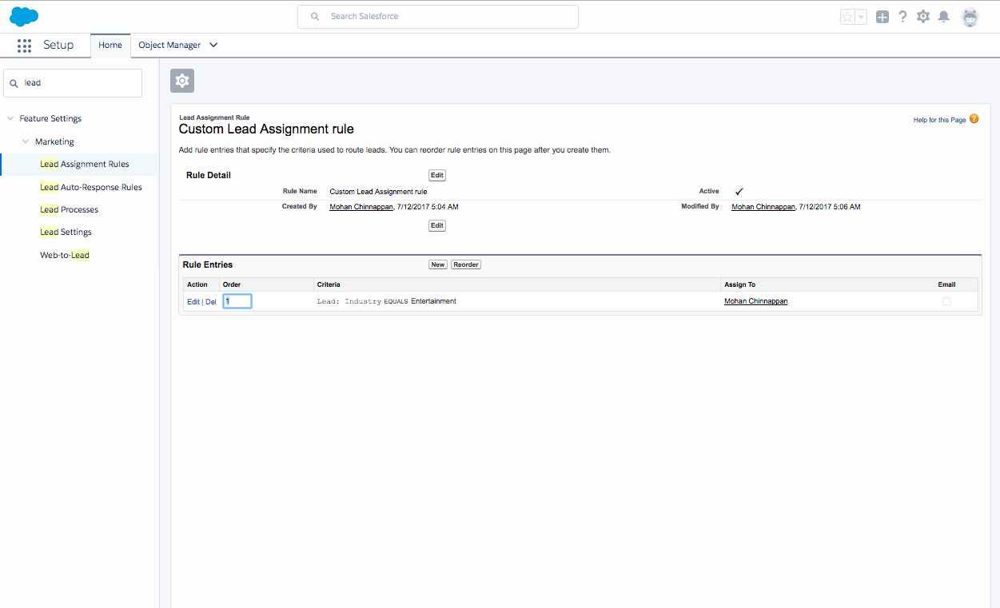
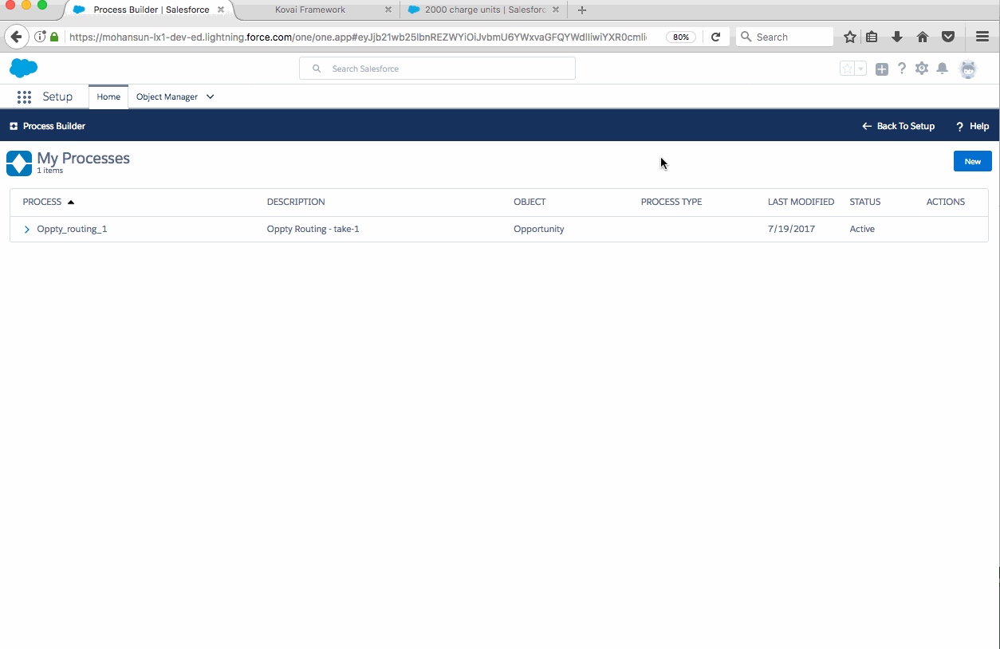

## SFDC Process Builder notes

### I. How to use Process Builder to provide Opportunity Assignment Rules feature (like Lead and Case Assignment rules)?


Screenshot showing sample Lead Assignment Rule:

``` python
if  Lead.Industry == 'Entertainment' :
	assign_to('this_user')
```




#### Use case

- Assign the owner for the Opportunity record being created based on this Criteria:

	A. Opportunity.Amount            >= $30,000
	B. AND Opportunity.Probability   >=  50% 
	C. OR Opportunity.Stage == 'Value Proposition'
	
	So the logic needed is : **A AND (B OR C)**


Demo showing the Opportunity Assignment :


- Post to Chatter page of the user (to whom this newly created Opportunity is assigned to) about this assignmet:

Example:
``` Opportunity: 800 solar panels with amount: 34,000 in stage:Value Proposition is just routed to you!
```

Demo showing the chatter post:




	

 
