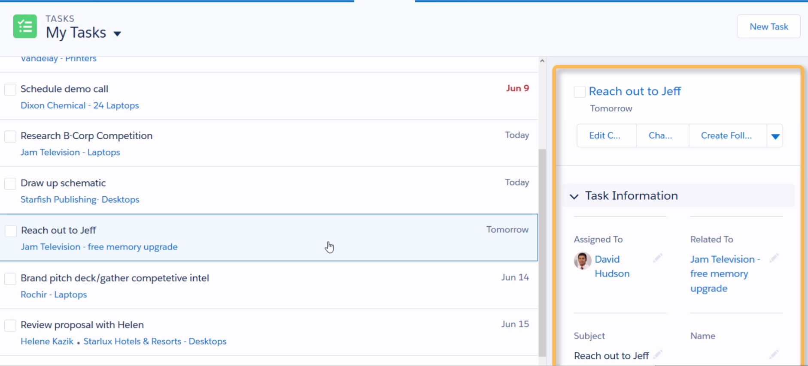
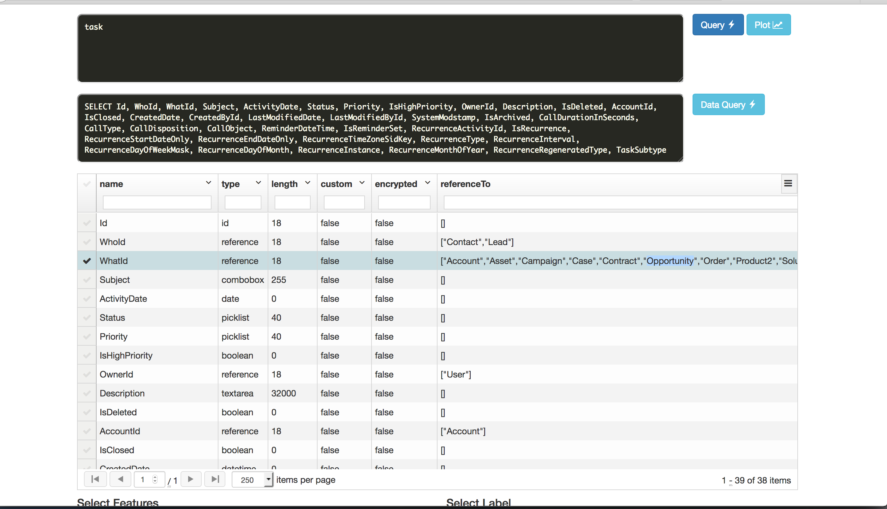
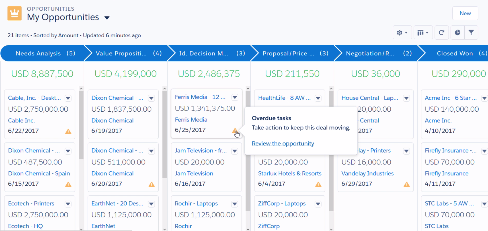
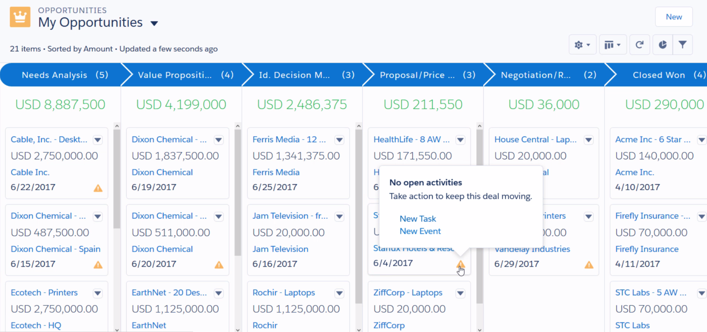
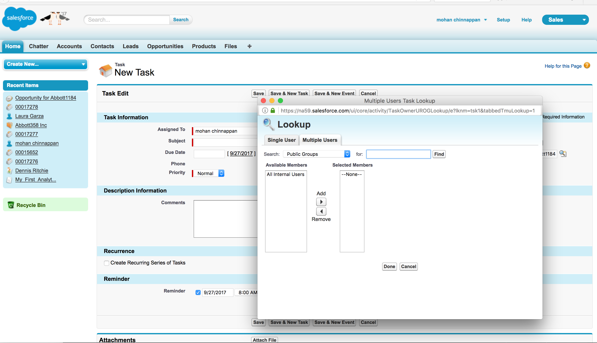
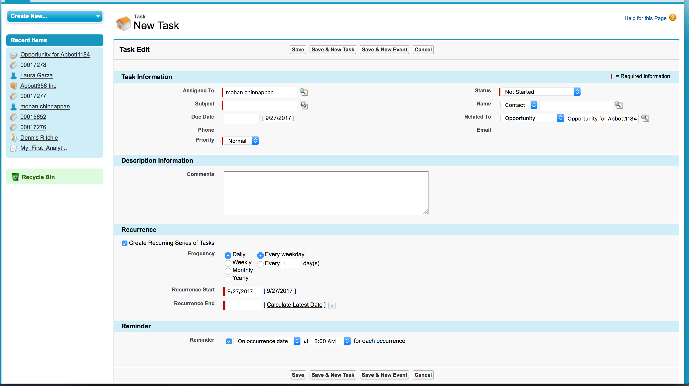
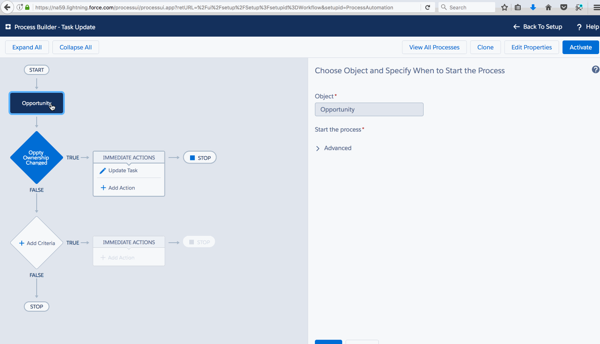

### Activites
   - Tasks
   - Events 

**Tasks**

Keep your to-do list in Salesforce and stay right on top of your deals and accounts.



Managing your tasks in Salesforce is the ideal way to stay on top of your customer relationships.

 

Easily relate every task to records for:

 - leads, 
 - contacts, 
 - campaigns, 
 - contracts,
 -  and other information that you need
 
 Salesforce gives you different tools to maximize productivity—quick ways to :
 
 1. create and update tasks, 
 2. prefiltered task lists
 3. task notification options


#### Data Model

WhoId (Lead and Contact) and WhatId (Account, Opportunity, Campaign, Case, Asset, Contract, Product2, Solution, Custom-Object-with-Activities):


### Describe Task





#### Lightning Kanban view

##### Opportunity in Proposal Stage with  overdue tasks


##### Opportunity in Proposal Stage with  no activities



##### How to assign a task to multiple people


You can assign up to 100 coworkers an independent copy of the same task:




##### Recurring task support


------

#### Task update using Process Builder

**Use case**

```
 When the an Opportunity field (say OwnerId) got updated, 
 use process builder to update related (in-progress) tasks

```



#### References

1. [Guidelines for tasks](https://help.salesforce.com/articleView?id=creating_tasks.htm&type=5)
2. [Video: Tasks To Boost Your Sales Productivity](http://salesforce.vidyard.com/watch/XyjzCo8PpbCZz-2MV-laPQ)
3. [Tasks](https://help.salesforce.com/articleView?id=tasks.htm&type=0)
4. [Set Up Tasks for Your Sales Reps](https://help.salesforce.com/articleView?id=customizeactivities_taskoptions.htm&type=5)
5. [Automate Basic Business Processes with Process Builder](https://trailhead.salesforce.com/en/modules/business_process_automation/units/process_builder)
6. [Give Flows Access to Apex Classes More Easily](http://releasenotes.docs.salesforce.com/en-us/spring15/release-notes/rn_forcecom_flow_apex.htm)
7. [Replacing Apex Triggers with Invocable Actions](http://www.desynit.com/dev-zone/salesforce-development/replacing-apex-triggers-processes-invocable-actions/)
8. [Triggers and Order of Execution](https://developer.salesforce.com/docs/atlas.en-us.apexcode.meta/apexcode/apex_triggers_order_of_execution.htm)


